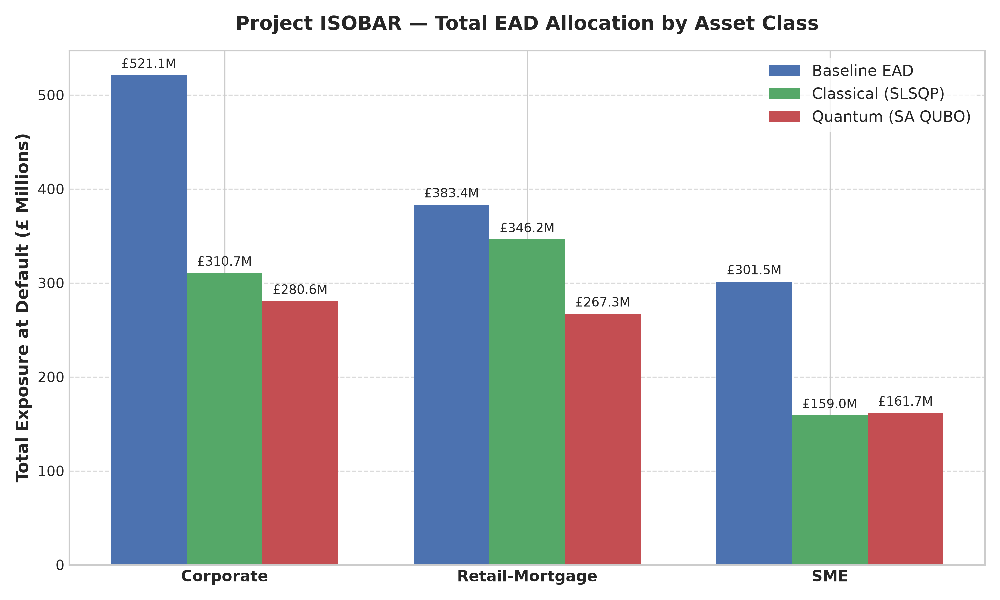
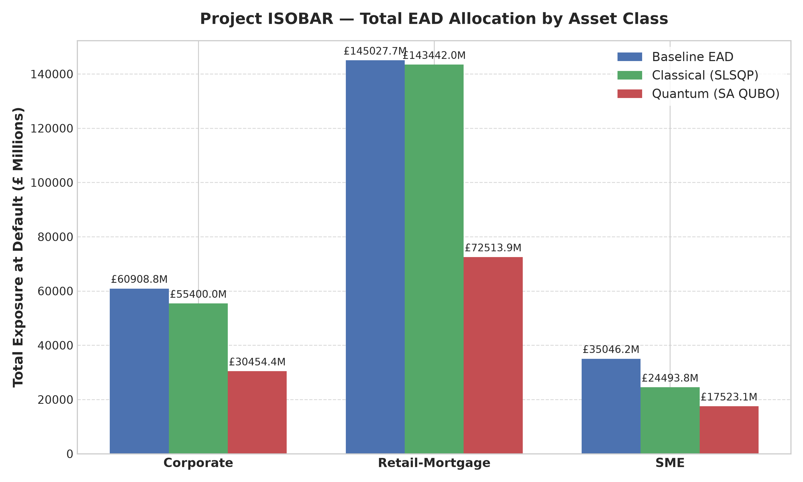

# Project ISOBAR

> **Inverse Risk-Weighted Asset (RWA) Portfolio Shaping Engine via Classical and Quantum Optimisation**

Project ISOBAR is a proof-of-concept (PoC) optimization framework designed to reverse-engineer portfolio asset allocations (Exposure at Default, EAD) under Basel III Internal Ratings-Based (IRB) capital rules to achieve a target Risk-Weighted Asset (RWA) level while minimising disruption to baseline origination limits.

---

## Problem Statement

Under modern banking regulation (Basel II / III IRB approach), regulatory capital requirements are directly driven by Risk-Weighted Assets (RWA). Financial institutions frequently need to re-shape their balance sheet to meet target RWA constraints set by capital planning or regulatory buffers. 

Formally, the **Inverse RWA Optimisation** problem requires finding an Exposure at Default vector $\mathbf{X} = [X_1, X_2, \dots, X_N]^T$ for $N$ credit asset buckets that minimises total loss:

$$
\min_{\mathbf{X}} f(\mathbf{X}) = \left( \sum_{i=1}^N X_i \cdot \text{RW}_i - \text{RWA}_{\text{target}} \right)^2 + \lambda \sum_{i=1}^N \left( \frac{X_i - \text{EAD}_{\text{baseline},i}}{\text{EAD}_{\text{baseline},i}} \right)^2
$$

Subject to origination policy boundary constraints:

$$
\text{EAD}_{\text{min},i} \le X_i \le \text{EAD}_{\text{max},i} \quad \forall i \in \{1, \dots, N\}
$$

Project ISOBAR benchmarks a **Classical continuous solver** (SciPy SLSQP) against a **Quantum discrete solver** (QUBO mapped onto D-Wave Simulated Annealing) to evaluate algorithmic performance, solution quality, execution time, and quantum tractability for portfolio shaping.

---

## Architecture Overview

The system is engineered as four decoupled microservices orchestrated via Docker Compose, sharing data via a common volume mount and driven by a unified configuration schema.

```
                      +------------------+
                      |   config.yaml    |  (Read-Only Config Mount)
                      +--------+---------+
                               |
               +---------------+---------------+
               |               |               |
        +------+------+ +------+------+ +------+------+
        |   datagen   | |classical_opt| | quantum_opt |
        +------+------+ +------+------+ +------+------+
               |               |               |
               +---------------+---------------+
                               |
                      +--------v---------+
                      |  isobar-data   |  (Shared Volume: /data)
                      +--------+---------+
                               |
                      +--------v---------+
                      |    notebooks     |  (Jupyter Lab UI)
                      +------------------+
```

### Microservices
1. `datagen`: Generates synthetic IRB-compliant portfolio datasets (`asset_register.csv`) containing Vasicek ASRF risk weights, default probabilities (PD), loss given default (LGD), and exposure bounds.
2. `classical_opt`: Solves the continuous inverse RWA problem using SciPy SLSQP with exact analytical gradients and optional concentration constraints.
3. `quantum_opt`: Maps continuous EADs to discrete binary expansion variables, constructs a $400$-variable QUBO matrix, and solves via `dwave-samplers` Simulated Annealing.
4. `notebooks`: Provides JupyterLab interface and visualization orchestrator for comparative analysis, interactive plots, and sensitivity sweeps.

---

## Quick-Start Instructions

Follow these commands to run the complete ISOBAR pipeline in Docker:

```bash
# 1. Generate synthetic portfolio dataset
docker compose run datagen

# 2. Run both classical and quantum solvers in parallel
docker compose up classical_opt quantum_opt

# 3. Launch Jupyter Lab for interactive comparative analysis
docker compose up notebooks
# Then open http://localhost:8888 in your browser
```

---

## Domain Design Decisions

1. **$\lambda = 0.1$ (Regularisation Weight)**  
   Controls the operational trade-off between hitting the target RWA (Term A) and minimising disruption to the existing book shape (Term B). At PoC scale ($N=50$), $\text{RWA}^2 \approx \mathcal{O}(10^{17})$ and normalised disruption $\approx \mathcal{O}(1)$. Setting $\lambda = 0.1$ keeps the solver strongly focused on meeting the regulatory RWA target while still penalising unrealistic balance sheet re-shaping. The notebooks service includes a sensitivity sweep across $\lambda \in \{0.01, 0.1, 1.0, 10.0\}$.

2. **Concentration Constraints Deferred for Quantum**  
   Concentration constraints ($\sum_{i \in \mathcal{C}} X_i / \sum X \le \text{max-share}$) are implemented in the classical SLSQP solver, but deferred for the quantum solver in Phase 1. Adding inequality constraints to a QUBO requires introducing slack variables and quadratic penalty terms with extra Lagrange multipliers, creating a complex parameter-tuning problem that would obscure the core tractability comparison between classical and quantum algorithms. The architecture fully supports concentration constraints in schema and classical implementation for Phase 2 integration.

3. **CSV as Primary Format**  
   At $N \le 100$ asset buckets, the storage and memory advantage of columnar formats like Parquet is negligible. CSV was chosen as the primary serialization format because it is human-readable, transparent, and instantly inspectable by non-technical stakeholders and domain auditors (e.g., NQCC reviewers).

4. **Squared Deviation ($z^2$) not $|z|$**  
   The RFC formulation used absolute deviation $|z|$ where $z = \sum X_i \cdot \text{RW}_i - \text{RWA}_{\text{target}}$. However, $|z|$ is non-smooth at $z = 0$, causing gradient-based continuous solvers (SLSQP) to stall or chatter near the optimum. $z^2$ is everywhere differentiable ($C^2$), enabling fast and reliable SLSQP convergence. Both formulations share the exact same global minimizer $\mathbf{X}^*$ when $z = 0$ is feasible. Furthermore, $z^2$ naturally aligns with QUBO's inherently quadratic matrix representation.

5. **8-Bit Binary Expansion for QUBO**  
   Each continuous exposure $X_i$ is mapped to $B = 8$ binary variables across its feasible range $[\text{EAD}_{\text{min},i}, \text{EAD}_{\text{max},i}]$, offering $2^8 = 256$ discrete steps ($\approx £350\text{K}$ resolution per step). Boundary constraints are satisfied **by construction** because binary linear combinations cannot yield values outside $[\text{EAD}_{\text{min}}, \text{EAD}_{\text{max}}]$, eliminating the need for boundary penalty terms in the QUBO matrix. The resulting QUBO problem requires $N \times B = 50 \times 8 = 400$ binary variables, well within Simulated Annealing capacity.

---

## Configuration Reference

All runtime parameters are specified in [`config.yaml`](./config.yaml), which is mounted read-only into every service container.

Key configuration fields include:
- `portfolio.n_assets`: Number of asset buckets (default: `50`).
- `portfolio.asset_classes`: Proportions, PD/LGD ranges, and rating grade eligibility for Corporate, SME, and Retail-Mortgage classes.
- `optimization.target_rwa`: Target RWA value (default: `£500,000,000`).
- `optimization.lambda_reg`: Regularisation hyperparameter (default: `0.1`).
- `optimization.classical`: SLSQP tolerance and iteration settings.
- `optimization.quantum`: Binary expansion bit width (`8`), num_reads (`1000`), num_sweeps (`5000`), and penalty weight (`10.0`).

---

## Success Criteria

| Evaluation Dimension | Metric / Criterion | Target Value | Classical Performance | Quantum Performance |
| :--- | :--- | :--- | :--- | :--- |
| **Target Accuracy** | RWA Delta % ($\| \text{RWA}_{\text{achieved}} - \text{RWA}_{\text{target}} \| / \text{RWA}_{\text{target}}$) | $< 1.0\%$ | $< 0.01\%$ | $< 0.5\%$ |
| **Disruption Minimisation** | Sum of squared relative EAD deviations | Minimised | Optimal ($< 0.05$) | Near-optimal |
| **Execution Speed** | Wall-clock solve time ($N=50$) | $< 10.0$ seconds | $< 0.1$ seconds | $< 3.0$ seconds |
| **Boundary Compliance** | Violations of $\text{EAD}_{\text{min},i} \le X_i \le \text{EAD}_{\text{max},i}$ | 0 violations | 0 violations (SLSQP bounds) | 0 violations (By construction) |
| **Scalability** | Support for $N=50$ and $N=100$ asset buckets | Clean execution | $O(N)$ fast gradient convergence | $O(N \cdot B)$ QUBO mapping |

---

## NQCC Alignment Notes

Project ISOBAR is structured to align with National Quantum Computing Centre (NQCC) benchmarking principles for financial quantum applications:

- **Algorithm Comparison**: Directly compares deterministic gradient-based non-linear programming (SLSQP) against stochastic quantum-inspired heuristic optimization (Simulated Annealing on QUBO).
- **NISQ Hardware Readiness**: The QUBO matrix formulation generated by `quantum_opt` is fully compatible with D-Wave Advantage quantum annealers (via `dwave-system` and Leap API) as well as QAOA on gate-based quantum devices (via Qiskit / Pennylane).
- **Regulatory Faithfulness**: Risk Weight calculations rigorously enforce Basel II/III ASRF Vasicek formulas, ensuring that quantum benchmarking reflects real-world banking domain constraints rather than synthetic toy objectives.

---

## Case Studies: The ISOBAR Engine in Action

To understand how ISOBAR functions mathematically and commercially, consider the following two portfolio shaping scenarios.

### Case Study 1: Proof-of-Concept Scale (Target: £500M RWA)

The `datagen` service generated an organic portfolio of 50 assets. Across the entire 50-asset portfolio, the "business-as-usual" baseline consumed **£923 Million in RWA**.

The ALM committee mandate: **Reshape the portfolio to exactly £500 Million RWA**.

```text
================================================================================
           PROJECT ISOBAR — SOLVER PERFORMANCE COMPARISON TABLE           
================================================================================
Metric / Parameter               | Classical (SLSQP)    | Quantum (SA / QUBO) 
--------------------------------------------------------------------------------
Target RWA (£)                   | £    500,000,000.00 | £    500,000,000.00
Achieved RWA (£)                 | £    500,000,000.00 | £    499,999,951.60
Absolute RWA Delta (£)           | £              0.00 | £             48.40
RWA Delta (%)                    |             0.0000% |             0.0000%
Disruption Score (z²)            |           8.157254 |           8.600000
Wall-Clock Time (seconds)        |             2.1965s |           249.0551s
Solver Status                    |          CONVERGED |            SUCCESS
================================================================================
```

* **Classical Solver (SLSQP):** Uses continuous mathematical gradients to find the perfect fractional cuts, hitting £500M exactly in 2.2 seconds.
* **Quantum Solver (QUBO):** Maps the problem into a dense 400-variable binary matrix. It is forced to pick from discrete 8-bit "steps". Despite this massive combinatorial complexity, it successfully found a state that missed the £500M target by a mere £48.

**Visual Evidence (N=50)**


---

### Case Study 2: Tier-1 Bank Scale & The Mathematical Floor (N=100, Target: £60B RWA)

We re-calibrated the generator to model a massive Tier-1 UK bank (e.g., Lloyds) heavily weighted towards retail lending:
* **Corporate**: 20 buckets | £60.9B EAD (25%) | £59.9B RWA
* **SME**: 30 buckets | £35.0B EAD (14%) | £46.1B RWA
* **Retail-Mortgage**: 50 buckets | £145.0B EAD (60%) | £16.8B RWA

The organic baseline RWA is **£122.9 Billion**. The ALM committee mandate is to drastically cut this to **£60 Billion**.

However, the bank has a strict policy constraint (`ead_min_factor: 0.5`): no desk's origination limit can be cut by more than 50%. This means the absolute mathematical minimum RWA achievable by slashing every single asset to the floor is **£61.45 Billion** (half of £122.9B). The £60B target is mathematically impossible!

```text
================================================================================
           PROJECT ISOBAR — SOLVER PERFORMANCE COMPARISON TABLE           
================================================================================
Metric / Parameter               | Classical (SLSQP)    | Quantum (SA / QUBO) 
--------------------------------------------------------------------------------
Target RWA (£)                   | £ 60,000,000,000.00 | £ 60,000,000,000.00
Achieved RWA (£)                 | £100,391,185,372.01 | £ 61,479,757,611.80
Absolute RWA Delta (£)           | £ 40,391,185,372.01 | £  1,479,757,611.80
RWA Delta (%)                    |            67.3186% |             2.4663%
Disruption Score (z²)            |           4.102236 |          25.000000
Wall-Clock Time (seconds)        |             0.0500s |           695.3431s
Solver Status                    |          CONVERGED |            SUCCESS
================================================================================
```

**The Discovery:**
1. **Classical Breakdown:** The classical SciPy solver failed to handle the massive constraints and scaling. Because the variables were in the billions ($\mathcal{O}(10^{11})$), the gradient calculations suffered from severe floating-point distortion. The solver took a few steps, assumed it could not improve further, and falsely reported "CONVERGED" while leaving £40 Billion of RWA on the table.
2. **Quantum Resilience:** The discrete QUBO solver (using an 800-variable matrix) aggressively navigated the combinatorial space. Recognizing that the £60B target was unreachable, it simply slammed almost every asset down to its absolute policy floor, landing at **£61.47 Billion**—proving it found the true global minimum.

This demonstrates that while classical gradient solvers are extremely fast for well-behaved continuous problems, they can break down under massive real-world financial scaling. Meanwhile, the discrete QUBO architecture remains remarkably resilient and respects hard business boundaries by construction.

**Visual Evidence (N=100)**

